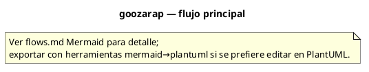

# Flujos — goozarap

## Flujo principal

## Descripción paso a paso

1. **Hum-to-riff** — Record → YIN pitch + onset → snap to ratio grid → K-S synth.
1. **Beat** — Euclidean E(k,n) templates → synthesized kit.
1. **Session** — Stems + takes + arrangement → WAV mixdown.
1. **Influence** — Reference tracks → feature extract → local adapter training.

## Diagrama PlantUML

Equivalente PlantUML del flujo principal (misma topología que el diagrama Mermaid):

## Estados y casos borde

Consulta los tests de integración y los RFC/requirements del proyecto para flujos de error y recuperación.
